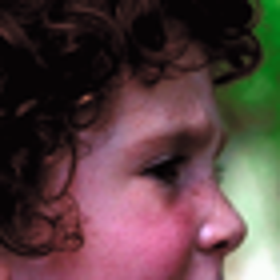
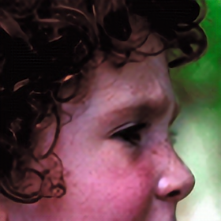

# Caffe_SRGAN #
A caffe implementation of Christian et al's ["Photo-Realistic Single Image Super-Resolution Using a Generative Adversarial Network"](https://arxiv.org/abs/1609.04802/ "https://arxiv.org/abs/1609.04802/") paper.
## Dependencis
### Train
* ubuntu 14.04
* CUDA 7.5
* Caffe

### Test ###
#### 1. obtain the SR imgs:
* ubuntu 14.04
* pycaffe

#### 2. compute\_psnr\_ssim:
* windows 10
* matlab

## Usage
1. Overload or add the caffe\_gan/caffe.proto, solver.cpp and  caffe\_gan/include/*_layer.hpp and caffe\_gan/src/*_layer.cpp *_layer.cu  to your caffe

2. 
```
 cd caffe && make clean && make all && make pycaffe 
 ```

3.  
```
 cp -r SRGAN caffe/examples/ 
 ```
 
4. Preparing training data: crop images of the ImageNet dataset into 75*75*3 sub-imgs and save as .h5  format（my training set: 192000x3x75x75）
   * My implementation is in the win10 matlab : run utils/Generate_data/mygenerate_sr_trainx4.m

5. Preparing testing data: crop images of the Set5 to 75*75*3 sub-imgs and save as .h5 format
   * My implementation is in the win10 matlab : run utils/Generate_data/mygenerate_sr_testx4.m
6. Training SRResNet-MSE:
   ```
    cd yourpath/caffe && sh examples/SRGAN/train_srres_75s.sh
    ```

7. Testing SRResNet-MSE:
   ``` 
   cd yourpath/caffe/examples/SRGAN/ && python srres-deploy.py 
   ```

8. Training SRGAN-MSE:
   ```
    cd yourpath/caffe && sh examples/SRGAN/train_srgan_is2.sh 
    ```

9. Testing SRGAN-MSE:
   ```
    cd yourpath/caffe/examples/SRGAN/ && python srres-deploy.py 
    ```
## Benchmarks
Currently, the SRResNet-MSE worked well ,but it is still training and tuning. 
 > *Factor 4 : Set5*

 |Benchmarks|SRResNet-MSE(official)|SRResNet-MSE(mine)|
 |:---:|:---:|:---:|
 |PSNR|32.05|31.40|
 |SSIM|0.9019|0.8813|

## Results
*Factor 4 : Set5*

|Bicubic|SRResNet-MSE(mine)|Ground Truth|
|:---:|:---:|:---:|
||||
||||
||||
||||
||||


## Notes
1. Before you train the networks , maybe you should change the  directory path of training and testing data. 
2. Here offer a model named SRResNet_75s_iter_30000.caffemodel which you can finetuning .
3. Currently, the SRGAN-MSE doesn't work well , and it is still training and tuning. 

## Implementation Details
1.  According the paper ["Real-Time Single Image and Video Super-Resolution Using an Efficient
Sub-Pixel Convolutional Neural Network"](http://www.cv-foundation.org/openaccess/content_cvpr_2016/papers/Shi_Real-Time_Single_Image_CVPR_2016_paper.pdf) , I implementated the pixelshffuler_layer, which is added to reshape_layer.hpp && .cpp . If you want to use pixelshuffler_layer by yourself , just following this:
```
layer{
    name: "psx2_1"
    type: "Reshape"
    bottom: "conv_g35"
    top: "psx2_1"
    reshape_param {
       pixelshuffler: 2
    }
}
```

2. For the GAN parts, the code borrows heavily from ["在caffe 中实现Generative Adversarial Nets（二）"](http://blog.csdn.net/seven_first/article/details/53100325) However , I add some new features to GAN parts. For examples , make gan_mode support the parameter "iter\_size". When your  gan_networks out of memory ,you can set the iter\_sieze : 2 . For more details ,you can refference my srgan_is2\_solver.prototxt and train_srgan_is2.prototxt
3. For the utils of compute_psnr\_ssim , the code borrows from this link [https://github.com/ShenghaiRong/caffe-vdsr](https://github.com/ShenghaiRong/caffe-vdsr) . But I modified the codes a lot.

## Plans
* [ ] Finetuning the SRResNet-MSE model.
* [ ] Properly train the SRGAN-MSE model.
* [ ] Train the SRResNet-VGG networks.
* [ ] Train the SRGAN-VGG networks.
* [ ] Improve docs & instructions


     


